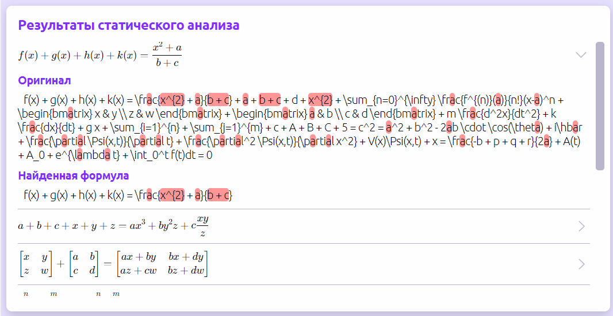

# Анализ формул

Вторая, но не по важности, функция Equilibria — анализ формул на совпадение.&#x20;



### Импортируйте и редактируйте и экспортируйте!

Импорт, редактирование и экспорт аналогичны этим же функциям в разделе создания формул.



### Анализируйте

Вам предоставлены 2 вида анализа: статический и семантический.

В статическом анализе нажмите на стрелочку, чтобы развернуть более подробное описание проведенного анализа.

<figure><figcaption></figcaption></figure>

В семантическом анализе вам сразу выводится вся доступная информация о формуле.

<figure><figcaption></figcaption></figure>


